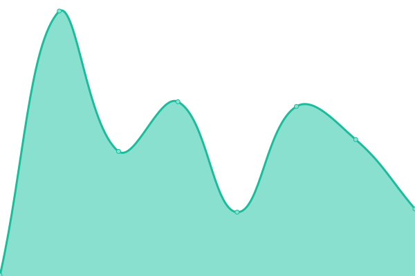
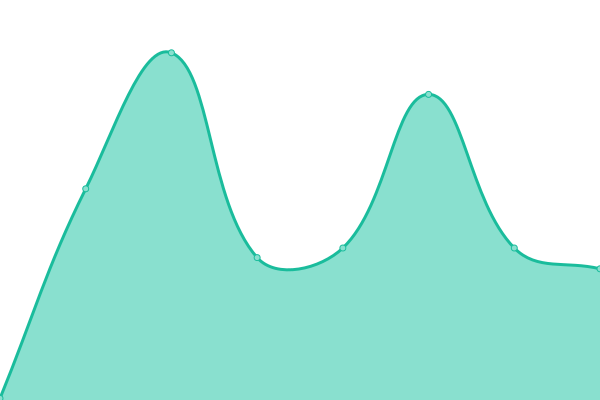
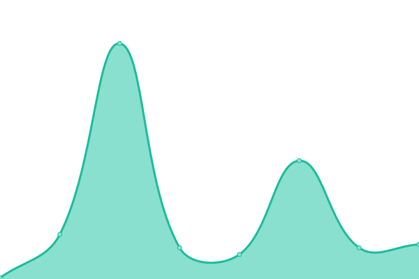

# [📈 Live Status](https://fsdh-pfds.github.io/status-statut): <!--live status--> **All systems are operational / Tous les systèmes sont opérationnels**

This repository contains the open-source uptime monitor and status page for [Federal Science DataHub (FSDH) - Plateforme fédérale de données scientifiques (PFDS)](https://sds.canada.ca/), powered by [Upptime](https://github.com/upptime/upptime).

With [Upptime](https://upptime.js.org), you can get your own unlimited and free uptime monitor and status page, powered entirely by a GitHub repository. We use [Issues](https://github.com/fsdh-pfds/status-statut/issues) as incident reports, [Actions](https://github.com/fsdh-pfds/status-statut/actions) as uptime monitors, and [Pages](https://fsdh-pfds.github.io/status-statut) for the status page.

<!--start: status pages-->
<!-- This summary is generated by Upptime (https://github.com/upptime/upptime) -->
<!-- Do not edit this manually, your changes will be overwritten -->
<!-- prettier-ignore -->
| URL | Status | History | Response Time | Uptime |
| --- | ------ | ------- | ------------- | ------ |
|  [Production FSDH Portal](https://federal-science-datahub.canada.ca/login) | Up / Opérationnel | [production-fsdh-portal.yml](https://github.com/ssc-sp/status-statut/commits/HEAD/history/production-fsdh-portal.yml) | 

 2591ms
     
 | 

<a href="https://ssc-sp.github.io/status-statut/history/production-fsdh-portal">100.00%</a>
    

|  [Shared Services Canada GC site](https://www.canada.ca/en/shared-services.html) | Up / Opérationnel | [shared-services-canada-gc-site.yml](https://github.com/ssc-sp/status-statut/commits/HEAD/history/shared-services-canada-gc-site.yml) | 

 170ms
     
 | 

<a href="https://ssc-sp.github.io/status-statut/history/shared-services-canada-gc-site">100.00%</a>
    

|  [SDS Home Site](https://sds.canada.ca) | Up / Opérationnel | [sds-home-site.yml](https://github.com/ssc-sp/status-statut/commits/HEAD/history/sds-home-site.yml) | 

 178ms
     
 | 

<a href="https://ssc-sp.github.io/status-statut/history/sds-home-site">100.00%</a>
    

|  [FSDH T&C's EN](https://documentation.sds.canada.ca/en/Terms-And-Conditions.html) | Up / Opérationnel | [fsdh-t-and-c-s-en.yml](https://github.com/ssc-sp/status-statut/commits/HEAD/history/fsdh-t-and-c-s-en.yml) | 

 225ms
     
 | 

<a href="https://ssc-sp.github.io/status-statut/history/fsdh-t-and-c-s-en">100.00%</a>
    

|  [FSDH T&C's FR](https://documentation.sds.canada.ca/fr/Conditions-generales.html) | Up / Opérationnel | [fsdh-t-and-c-s-fr.yml](https://github.com/ssc-sp/status-statut/commits/HEAD/history/fsdh-t-and-c-s-fr.yml) | 

 135ms
     
 | 

<a href="https://ssc-sp.github.io/status-statut/history/fsdh-t-and-c-s-fr">100.00%</a>
    

<!--end: status pages-->

[**Visit our status website →**](https://fsdh-pfds.github.io/status-statut)

## 📄 License

- Powered by: [Upptime](https://github.com/upptime/upptime)
- Code: [MIT](./LICENSE) © [Anand Chowdhary](https://anandchowdhary.com), supported by [Pabio](https://pabio.com)
- Data in the `./history` directory: [Open Database License](https://opendatacommons.org/licenses/odbl/1-0/)
